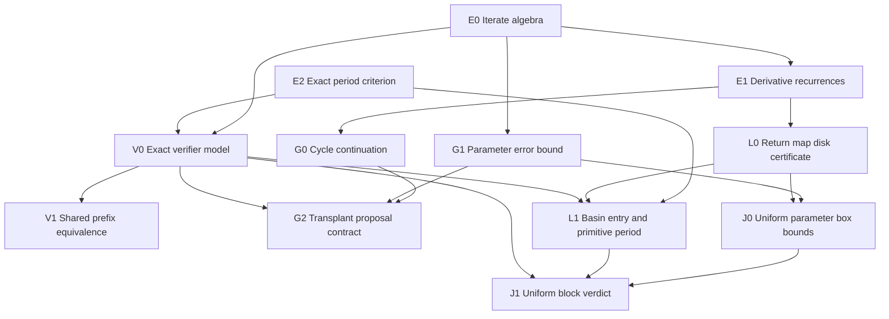

# Phase 2 Lean proof DAG

**Status:** E0 and E2 checked in the isolated [Lean pilot](../../proof/README.md); remaining nodes are scoped obligations.
**Consumer:** [performance mathematics](../PERFORMANCE-MATHEMATICS.md) and [implementation status](../PERFORMANCE-PLAN.md) on the Phase 2 branch.

This is a small, consumer-driven graph of mathematical statements that could justify specific classifier experiments. A node is a theorem or explicitly conditional contract. An arrow means the target needs the source as a mathematical prerequisite. Code links, tests, and benchmark gates are tracked separately; they are **not** proof edges.

## Rooted graph

The **pilot root** is E2: prove one generic exact-period theorem using Mathlib's periodic-point API. V1 is the first performance-facing target. G, L, and J are optional branches selected when the corresponding experiment needs a stronger guarantee. This graph is intentionally not a path toward Mandelbrot local connectivity.

## Nodes and proof boundaries

| ID  | Lean-facing statement or obligation                                                                                                                                                                                                                                                                                             | Direct consumer                                                                          | State                                                                                                                                                                                                                                               |
| --- | ------------------------------------------------------------------------------------------------------------------------------------------------------------------------------------------------------------------------------------------------------------------------------------------------------------------------------- | ---------------------------------------------------------------------------------------- | --------------------------------------------------------------------------------------------------------------------------------------------------------------------------------------------------------------------------------------------------- |
| E0  | Define `f c z = z² + c`, `orbit c n z = (f c)^[n] z`; establish zero iterate, successor, and iterate addition.                                                                                                                                                                                                                  | Every subsequent node                                                                    | Proved in `proof/`                                                                                                                                                                                                                                  |
| E1  | For a return orbit, `D₀ = 1`, `Dₙ₊₁ = 2 zₙ Dₙ`; for the critical orbit's parameter derivative, `B₀ = 0`, `Bₙ₊₁ = 2 zₙ Bₙ + 1`. State the starting point explicitly: for a varying cycle seed, `B₀` differs.                                                                                                                     | G0, L0, multiplier contract                                                              | Specified                                                                                                                                                                                                                                           |
| E2  | If `p > 0` and `f^[p] x = x`, then `minimalPeriod f x = p` iff `f^[(p/q)] x ≠ x` for every prime divisor `q` of `p`. Audit `p = 0`, existence of a prime divisor, and division assumptions.                                                                                                                                     | Exact primitivity; optional center catalog                                               | Proved in `proof/`                                                                                                                                                                                                                                  |
| V0  | Define a pure, exact-arithmetic model of closure, ordered proper-divisor reduction, multiplier, and a three-way accept/ambiguous/exclude policy **with abstract ordered thresholds**. Its verdict is a model of [verifier.ts](../../src/domain/verifier.ts), not a certificate that its floating thresholds imply true closure. | V1, G2, L1, J1                                                                           | Specified                                                                                                                                                                                                                                           |
| V1  | Given equal orbit prefixes, candidate period, thresholds, and initial result record, the inlined lag-scan verifier and common verifier model produce the same verdict and accepted fields; a refusal leaves the record untouched. Factor out finite-value checks as an explicit precondition or separately modeled decision.    | [orbit.ts](../../src/domain/orbit.ts) versus [verifier.ts](../../src/domain/verifier.ts) | First implementation target                                                                                                                                                                                                                         |
| G0  | For `Fₚ(z,c)=f_c^[p](z)-z`, an exact periodic point with `λ=(f_c^[p])'(z) ≠ 1` admits a local branch `z*(c)` with derivative `∂c f_c^[p](z)/(1-λ)`. Choose a consistent cycle phase.                                                                                                                                            | Adjacent-pixel transplantation G                                                         | Conditional                                                                                                                                                                                                                                         |
| G1  | If `eₙ = orbit (c+δ) n z - orbit c n z` with the same initial seed, then `eₙ₊₁ = 2 zₙ eₙ + eₙ² + δ`. Derive an inductive absolute bound from explicit orbit and parameter bounds. A varying seed needs its own `e₀`.                                                                                                            | G and later J                                                                            | Conditional                                                                                                                                                                                                                                         |
| G2  | Under a region bound keeping `                                                                                                                                                                                                                                                                                                  | 1-λ                                                                                      | `away from zero and a quantified higher-order remainder, bound predictor error for G0; a corrected seed is a **candidate** until V0 adjudicates it. A proof of local continuation alone does not prove the existing`guardDisplacement = 0.01` safe. | [transplant PoC](../../poc/performance/src/kernels/transplant.ts) | Conditional                                                                     |
| L0  | For return map `g=f_c^[p]`, a closed disk `D(a,r)` is mapped into itself and is contractive if a validated bound `sup_D                                                                                                                                                                                                         | g'                                                                                       | ≤ q < 1`and`                                                                                                                                                                                                                                        | g(a)-a                                                            | + qr ≤ r`hold. Prove existence and uniqueness of a fixed point in the disk and` | λ   | ≤ q`. | Trap-radius early acceptance L | Research |
| L1  | Prove that the critical orbit enters the L0 disk (or state an explicit entry precondition); establish the claimed **primitive** period or return unresolved. Distinguish a return-map fixed point from an attracting cycle selected by the critical orbit.                                                                      | [trap PoC](../../poc/performance/src/kernels/trap.ts)                                    | Research                                                                                                                                                                                                                                            |
| J0  | Extend G1 and L0 inequalities uniformly over a parameter rectangle using outward interval/ball enclosures, including all intermediate iterates and derivative bounds.                                                                                                                                                           | Rigorous subdivision J                                                                   | Research                                                                                                                                                                                                                                            |
| J1  | If every parameter in a rectangle satisfies the same certified classification and period hypotheses, propagate that status over the block; otherwise subdivide or run the per-pixel verifier. Matching sampled corners is insufficient.                                                                                         | Rigorous block fill J                                                                    | Research                                                                                                                                                                                                                                            |

**Edges are proof prerequisites, not statements of current implementation.** A V1 proof concerns a mathematical model of two verifier paths; a refinement argument plus differential tests must still connect that model to TypeScript. E2 concerns **exact equality** and cannot turn a binary64 residual smaller than `1e-8` into a proof of exact period. L0/L1/J0/J1 would require genuine outward enclosures to justify a certified result; the current double-double oracle is a floating reference.

## Execution order and gates

1. **Pilot (complete):** [E0 and E2](../../proof/IntMProof.lean) compile under Lean `v4.33.1` and Mathlib `0df444a360eaa60ab8c11dca51a86af692955474`; [the manifest](../../proof/lake-manifest.json) pins dependencies. [Axiom guards](../../proof/IntMProof/Axioms.lean) record the precise axiom sets and fail on changes. Evaluate whether V0/V1's consumer uses the exact criterion before expanding.
2. **Verifier:** formalize only the minimal V0 decision procedure and prove V1 for the shared prefix. State where TypeScript finite checks, signed zero, NaN, infinity, and rounding cross the abstraction boundary. Preserve the existing differential/oracle tests for actual code.
3. **Transplantation (G):** use E1, G0, and G1 to replace the heuristic guard with a _stated_ bound, or retain the guard as a proposal filter. Keep Newton correction and V0 separate.
4. **Trap (L):** advance only after disk inclusion, contraction, critical-orbit entry, and primitive-period obligations can all be expressed with computable enclosures.
5. **Subdivision (J):** advance only if a uniform box certificate is both sound and cheaper than the pixels it replaces.

H (period algebra and center generation) is a separate **optional** consumer of E2: the generator currently tests all proper divisors with numerical residuals in [generate_catalog.py](../../tools/generate_catalog.py). It needs its own symbolic polynomial/division and root-enclosure obligations before any claim about enumerated centers becomes certified. Candidate ordering, checkpoint scheduling, SIMD, worker bands, and browser latency do not gain a useful guarantee from this Lean DAG.

## Phase 3 and later research: gated extensions

[Phase 3](../PLAN.md#phase-3--measured-numerical-extension) is conditional on a demonstrated product gap and [ADR 0002's perturbation gate](../decisions/0002-phase-0-renderer-zoom-and-gpu-gate.md). The independently listed research overlays are not automatic Phase 3 requirements. Add these nodes only when their consumer is selected; none is presently proved.

| Proposed ID                   | Requires                       | Precise target and consumer                                                                                                                                                                                                                                                                      | Priority if selected                  |
| ----------------------------- | ------------------------------ | ------------------------------------------------------------------------------------------------------------------------------------------------------------------------------------------------------------------------------------------------------------------------------------------------ | ------------------------------------- |
| P1 — perturbation identity    | E0, G1                         | With reference orbit `Zₙ` at `c₀` and pixel orbit `zₙ` at `c₀+δc`, prove `dₙ=zₙ-Zₙ` obeys `dₙ₊₁=2Zₙdₙ+dₙ²+δc`, including its initial condition. This is an exact identity, even when `dₙ` is not small.                                                                                          | High; short proof                     |
| P2 — rebase invariant         | P1                             | At the **same iterate** `n`, with new reference `Z'ₙ` at `c₁`, prove `δc'=c-c₁` and `d'ₙ=dₙ-(Z'ₙ-Zₙ)` preserve `zₙ=Z'ₙ+d'ₙ` and P1's recurrence. State rebase index, phase, and reference validity.                                                                                              | High; short proof                     |
| P3 — accuracy and glitch rule | P1, P2, G1, E1                 | Propagate an upper bound for reference-orbit, delta-orbit, and parameter-rounding errors; give an explicit condition that triggers rebase, subdivision, CPU repair, or unresolved **before** period/multiplier acceptance. Exact algebra alone cannot justify a floating-point glitch threshold. | High value; hard representation proof |
| D0 — interior field           | E1, G0                         | Define a potential or distance _proxy_ on a stated hyperbolic chart. A first-order quantity such as `(1-                                                                                                                                                                                         | λ                                     | )/  | λ'(c) | ` is not a certified Euclidean distance to the component boundary without a domain and remainder bound. | Medium after field definition |
| X0 — exterior potential       | E0, escape-radius lemma        | Define the exterior escape-rate potential and its normalization, then bound finite-orbit approximations on an explicitly escaping region. For external-angle charts also specify a branch and validity domain; do not identify a finite escape iterate with a certified external ray.            | Medium to high after overlay design   |
| S0 — Significant Curves       | E2, analytic period-1/2 lemmas | Start with one explicit low-period polynomial or parametrized curve, prove exact-period exclusions and the claimed locus. A resultant can include spurious branches; a plotted curve needs a stated approximation error.                                                                         | Medium after choosing one curve       |
| R0 — real-slice ordering      | E2                             | Specify a real interval map and a particular orbit-forcing relation before proving or displaying a selected Sharkovsky relation. This does not order all complex components.                                                                                                                     | Low until an overlay is specified     |
| N0 — renormalization chart    | E0                             | First prove a concrete return map on a stated restricted domain and its relation to the canonical parameter `c`; polynomial-like properness and a straightening-coordinate theorem are much larger subsequent obligations.                                                                       | Research only                         |
| F0 — parabolic coordinates    | E0                             | Fix a parabolic point, petal, and Fatou-coordinate domain before stating `Φ(f_c^[p](z))=Φ(z)+1`. Numerical evaluation and branch/normalization choice are separate obligations.                                                                                                                  | Research only                         |

The strongest small branch is `G1 → P1 → P2`: it checks the exact meaning of a rebase and reuses the same perturbation recurrence that bounds neighbor error. P3 is the essential numerical gate for using it in a renderer. A high-precision or Wasm backend has no new mathematical theorem merely because it changes representation; it needs a stated arithmetic error model and agreement with the same semantic verifier. Raising the 6,000,000× product ceiling still requires measured detection quality and latency.

Sources for exploratory claims: [Significant Curves of the Mandelbrot Set](https://mendel-journal.org/index.php/mendel/article/view/157) defines low-period curves; [Sharkovsky's Ordering in the Mandelbrot Set](https://arxiv.org/abs/2506.06163) studies real/tree orderings. Neither supplies a ready-made, verified classifier for this project.

## Evidence and status discipline

For each implemented node, record: ID, exact Lean declaration, natural-language claim, prerequisite IDs, source or derivation, Lean/mathlib commit, status (`specified`, `proved`, `conditional`, or `blocked`), admitted axioms, and the consuming code/test. Run a root-specific axiom check in CI after a Lean root exists; fail on `sorryAx` and unexpected project axioms. Never label a node proved from a green test or a graph edge inferred from text.

[kirill-kondrashov/mlc](https://github.com/kirill-kondrashov/mlc) is the model for **rooted declaration graphs and explicit axiom-frontier checks**: its [graph script](https://github.com/kirill-kondrashov/mlc/blob/main/scripts/generate_dependency_graph_site.py) derives textual usage edges, while [check_axioms.lean](https://github.com/kirill-kondrashov/mlc/blob/main/check_axioms.lean) checks the semantic axiom frontier. Its root theorem remains conditional on two named mathematical axioms; its local-connectivity modules and graph UI are outside this project's proof scope. This document's edges are reviewed mathematical obligations. If a declaration graph is later generated automatically, label inferred edges as such and use Lean's checked imports and axiom report as authority.

The release boundary remains: **formal theorem → mathematical contract → numerical implementation → floating-point error/differential tests → target-browser benchmarks**. The [Phase 2 status](../PERFORMANCE-PLAN.md) still keeps the legacy scan as default pending Stage A evidence; proof work does not waive that gate.
