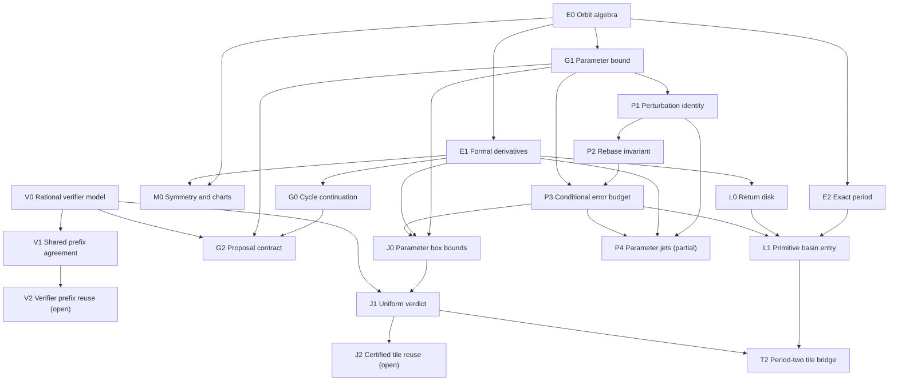

# Lightweight Lean proof DAG

**Status:** The [Lean project](../../proof/README.md) checks the algebraic roots E0/E1/E2/M0/V0/V1, conditional performance contracts, and the scoped Phase 3 results listed below. A concrete period-two tile has independent exact-rational verifier and attracting-trap certificates, connected by a proved parameter inclusion. All-order parameter jets have checked Taylor/Hasse coefficient convolution and exact finite truncation, with a conditional finite-support norm bound. Recursive retained-order caps and P3 disk error budgets now avoid the full discarded polynomial, with finite outward-table consumers and third-order certificates at parameters zero and minus one. The minus-one disk has a uniform truncation cap through sixteen iterates; conditional separate multiply/add Horner and decoded coefficient budgets preserve that cap with stated local error allowances. Offset discrepancy uses a separate P3 comparison. Scalar primitive contracts and finite retained generation budgets now have executable unbounded-integer dyadic correspondence, with proved primitive residuals. Copied real integer anchors and seeds have exact retained generation; a concrete 42-bit fractional-grid minus-one generator/evaluator preserves the `1/1000000` disk cap through iterate sixteen. Binary64 and TypeScript refinement, production guard constants, and the larger Phase 3 research targets remain open. CI audits the namespace for `sorryAx`.

An arrow denotes a mathematical prerequisite for a theorem or contract. Tests, implementation links, and benchmark gates are tracked separately. The graph is consumer driven; it is not a proof of Mandelbrot local connectivity.

## Checked roots and boundaries

| ID  | Lean declarations                                                                                                                                                                                                                                                                                                                                    | Claim and direct consumer                                                                                                                                                                                                                                                                                                                                                                                             | State                                                |
| --- | ---------------------------------------------------------------------------------------------------------------------------------------------------------------------------------------------------------------------------------------------------------------------------------------------------------------------------------------------------- | --------------------------------------------------------------------------------------------------------------------------------------------------------------------------------------------------------------------------------------------------------------------------------------------------------------------------------------------------------------------------------------------------------------------- | ---------------------------------------------------- |
| E0  | `quadratic`, `orbit`, `orbit_zero`, `orbit_succ`, `orbit_add`                                                                                                                                                                                                                                                                                        | Quadratic iteration over a commutative ring; common basis for all orbit arguments.                                                                                                                                                                                                                                                                                                                                    | Proved                                               |
| E2  | `exactPeriod_iff_prime_quotient`, `exactPeriod_iff_closure_and_prime_quotients`, `exactPeriod_iff_proper_divisors`, `exactPeriod_iff_closure_and_proper_divisors`, `prime_quotients_iff_proper_divisors`, `exactPeriod_iff_first_return`, `criticalPeriod_iff_prime_quotients`, `criticalPeriod_iff_proper_divisors`                                 | Exact closure plus prime-quotient exclusions, all proper-divisor exclusions, or first positive return characterize the minimal period. Closure may be bundled with either quotient test. The candidate is positive; numerical near-closure is not exact closure. The critical-orbit forms are the catalog's divisor condition.                                                                                        | Proved                                               |
| E1  | `seedPolynomial_eval`, `seedPolynomial_derivative_zero`, `seedPolynomial_derivative_succ`, `seedPolynomial_derivative_eval_prod`, `parameterPolynomial_eval`, `parameterPolynomial_derivative_zero`, `parameterPolynomial_derivative_succ`, `fixedSeed_parameter_derivative_zero`, `fixedSeed_parameter_derivative_eval_sum`                         | Formal polynomial derivatives prove seed recurrence D₀ = 1, Dₙ₊₁ = 2zₙDₙ, hence Dₙ = ∏*{k<n} 2zₖ, and parameter recurrence Bₙ₊₁ = 2zₙBₙ + 1. For a variable seed B₀ is its derivative; a constant seed gives B₀ = 0 and Bₙ = ∑*{k<n} ∏*{t<n−k−1} 2z*{k+1+t}. The product is the formal multiplier. It does not identify the TypeScript complex product loop.                                                          | Proved                                               |
| M0  | `orbit_map`, `minimalPeriod_map`, `transport_orbit`, `transport_minimalPeriod`, `negChart`, `negChart_quadratic`, `negChart_minimalPeriod`, `conjugate_orbit`, `conjugate_minimalPeriod`, `conjugate_seedDerivative`, `conjugate_seedDerivative_normSq`, `conjugate_fixedSeed_parameterDerivative`, `conjugate_fixedSeed_parameterDerivative_normSq` | Injective ring maps preserve exact period. Bijective charts preserve period under conjugated dynamics. Complex conjugation transports the orbit, exact period, seed derivative, constant-seed parameter derivative, and both squared magnitudes. `negChart` is Mathlib's `Equiv.neg` and sends the quadratic to `w ↦ −w² − c`.                                                                                        | Proved                                               |
| V0  | `Thresholds`, `Frame`, `properDivisors`, `mem_properDivisors`, `properDivisors_pairwise`, `referenceReduction`, `referenceReduction_eq_reduced_iff`, `referenceReduction_reduced_least`, `decide`, `reference`, `finish`                                                                                                                             | Ordered, exact rational decisions for closure, divisors, and multiplier acceptance on caller-supplied evaluated frames. `properDivisors` is strictly increasing. `.reduced d` means `d` is accepted and every earlier proper divisor is excluded, so it is the least such divisor. `decide` is the shared control flow. Payload fields are opaque. Models the order of [`verifier.ts`](../../src/domain/verifier.ts). | Proved model; TypeScript refinement open             |
| V1  | `inlineReduction`, `inlineReduction_eq_reference`, `inlineReduction_eq_reduced_iff`, `inline`, `inline_eq_reference`, `reference_refusal_preserves`, `inline_refusal_preserves`                                                                                                                                                                      | `inline` is `decide` applied to `inlineReduction`. Equal supplied frames, thresholds, candidate period, and old record imply equal verdict and output fields; rejection preserves the prior record. The inline and reference characterizations of `.reduced` agree. Corresponds to the inlined lag scan in [`orbit.ts`](../../src/domain/orbit.ts).                                                                   | Proved conditional model; TypeScript refinement open |

**Model precondition:** Frames contain exact rational residual squares and multiplier magnitudes with no NaN or infinities. A strict separation `acceptSquared < excludeSquared` is required. The theorem does not prove that binary64 `hypot`, rounding, signed zero, finite-value checks, transcendental angle/log fields, or period candidate selection refine these rational inputs. In particular, an accepted numerical residual does not imply exact periodicity. Existing differential and oracle tests are the current check against the actual code; a floating point error model would be required for a refinement proof. A chart theorem preserves period only for the transported map and corresponding point; it does not classify arbitrary parameter transformations of the canonical quadratic family.

## Conditional performance contracts

| ID  | Prerequisites | Precise target and consumer                                                                                                                                                                                                                                                                                                                                                                                                                                                                                                                                                                                                                                                                                                                                                                                                                                                                                                                                                                                                                                                                                                                                                                                                                                                                                                         | Status                                                                                                                                                                                                       |
| --- | ------------- | ----------------------------------------------------------------------------------------------------------------------------------------------------------------------------------------------------------------------------------------------------------------------------------------------------------------------------------------------------------------------------------------------------------------------------------------------------------------------------------------------------------------------------------------------------------------------------------------------------------------------------------------------------------------------------------------------------------------------------------------------------------------------------------------------------------------------------------------------------------------------------------------------------------------------------------------------------------------------------------------------------------------------------------------------------------------------------------------------------------------------------------------------------------------------------------------------------------------------------------------------------------------------------------------------------------------------------------- | ------------------------------------------------------------------------------------------------------------------------------------------------------------------------------------------------------------ |
| G0  | E1            | `exists_branch_slope` gives a local graph `t ↦ φ t` of exact period-n points through `(c, z)` with `φ' = B / (1 - λ)` when `λ ≠ 1`. `branch_slope` is that derivative for any differentiable map that stays on the period-n set, and `branch_denominator_phase` shows `1 - λ` is the same at every cycle point; `B` still depends on the point. `exists_periodic_implicitSection` is the kernel section of `(λ - 1) dz + B dc` that the graph reparameterizes.                                                                                                                                                                                                                                                                                                                                                                                                                                                                                                                                                                                                                                                                                                                                                                                                                                                                      | Local graph proved; a disk remainder stays open under G2                                                                                                                                                     |
| G1  | E0, E1        | The identity is `perturbation_zero` and `perturbation_succ`. The norm recurrence is `perturbation_norm_succ`. `seedShift` allows a different initial seed, with gap `‖z₁ - z₀‖`, and `seedShift_norm_le_perturbationBound` compares it with `perturbationBound`. The same-seed bound is `perturbation_norm_le_bound`. This is an exact complex-norm comparison. `orbit_norm_sub_le_budget` gives the varying-radius uniform orbit enclosure described below.                                                                                                                                                                                                                                                                                                                                                                                                                                                                                                                                                                                                                                                                                                                                                                                                                                                                        | Norm comparisons proved; supplied budgets still need arithmetic certification                                                                                                                                |
| G2  | G0, G1, V0    | `predictorDisplacement_eq` is `‖(B / (1 - λ)) δ‖ = ‖B‖ ‖δ‖ / ‖1 - λ‖`. `predictorDisplacement_le` replaces the denominator by a positive lower bound `α`. `branch_predictor_remainder` is the little-o remainder of that linear predictor along the local graph. `predictor_remainder_le_of_second_derivative_bound` gives a fixed-disk remainder from a uniform second-derivative bound, and `branch_displacement_le_on_disk` bounds actual branch displacement. The corrected seed remains a proposal until verified.                                                                                                                                                                                                                                                                                                                                                                                                                                                                                                                                                                                                                                                                                                                                                                                                             | Fixed-disk remainder conditional on derivative or second-derivative bounds; `guardDisplacement = 0.01`, `1e-12`, and concrete bounds open. [transplant PoC](../../poc/performance/src/kernels/transplant.ts) |
| L0  | E1            | `existsUnique_fixedPoint_orbit_of_multiplier_le`: if the formal multiplier of `orbit c n` is at most `q < 1` on a closed disk and `‖orbit c n z₀ - z₀‖ + q r ≤ r`, the disk contains a unique fixed point whose multiplier is at most `q`.                                                                                                                                                                                                                                                                                                                                                                                                                                                                                                                                                                                                                                                                                                                                                                                                                                                                                                                                                                                                                                                                                          | Contraction criterion proved; trap constants and critical entry open                                                                                                                                         |
| L1  | E2, L0        | `existsUnique_critical_return_of_entry`: if `orbit c k 0` lies in the return disk, later iterates `orbit c (k + m n) 0` stay there and approach the unique return fixed point at rate `q ^ m`. `minimalPeriod_return_fixedPoint_iff` is exact period of that fixed point. Entry of the critical orbit is still a hypothesis. `existsUnique_critical_return_of_error_budget` supplies entry when the approximate iterate's disk margin includes its certified error budget. `existsUnique_primitive_critical_return_of_error_budget` adds positive proper-divisor exclusion from derivative and center-separation bounds. `periodTwo_minusOne_primitive_trap` instantiates all bounds at c=−1 with r=1/16 and q=1/2. `periodTwo_near_minusOne_primitive_trap` extends the certificate to ‖c+1‖≤1/1024, with critical entry at time 2.                                                                                                                                                                                                                                                                                                                                                                                                                                                                                                | Conditional primitive-period and contraction certificates proved; a parameter disk ‖c+1‖≤1/1024 is certified with r=1/16, q=1/2; general trap policy remains open                                            |
| J0  | E1, G1, P3    | `orbit_norm_sub_le_budget` encloses the orbit for a norm-bounded parameter/seed region. `region_derivatives_le_budget` combines that prefix with `seedDerivative_norm_le_budget` and `parameterDerivative_norm_le_budget` to bound the multiplier and constant-seed parameter derivative throughout the same region. `closureResidual_variation_le_budget` and `closureResidual_sq_interval_of_budget` bridge an orbit budget to closure-residual enclosures. `rationalOrbit_residualSq_embed` and `rationalMultiplier_normSq_embed` identify exact rational-coordinate residual and multiplier squares with their complex norm squares at rational points. `rationalMultiplier_attract_iff` compares an exact rational multiplier square with a positive squared cutoff. `rationalBoxOrbit_sound` computes a sound finite orbit enclosure from exact rational boxes; `rationalBoxClosure_normSq_ge` and `_le` give lower and upper residual squares. `rationalBoxMultiplier_normSq_interval` computes lower and upper squared-multiplier bounds and its cutoff lemmas certify attraction or refusal. `periodTwoRationalTile_residual_margins` instantiates these bounds on a small rectangle around c=−1. Exact rational boxes may be conservative; binary64 outward rounding and connection to implementation frames remain open. | Exact rational orbit and derivative boxes plus one tile margin proved; machine outward rounding open                                                                                                         |
| J1  | J0, V0        | `uniform_verdict_of_interval_margins` proves one exact rational verifier verdict and, on acceptance, one period throughout a region whose candidate/divisor residual and multiplier intervals avoid every decision threshold. The reference verifier agrees. `periodTwoRationalTile_inline_accepts` and `_reference_accepts` instantiate the exact rational model on a small critical-seed rectangle using the unit-scale verifier thresholds. `periodTwoRationalTile_contains_nonperiodic` gives an accepted tile point whose critical orbit does not have exact period two. For other rectangles, derive interval certificates or subdivide/run per-pixel verification; corners alone do not suffice.                                                                                                                                                                                                                                                                                                                                                                                                                                                                                                                                                                                                                             | Conditional exact rational verdict and one rational tile proved; binary64 refinement and production block fill open                                                                                          |

**T2 (J1 + L1):** `periodTwoRationalTile_near_minusOne` proves tile containment in the certified trap disk. The J1 verdict follows from rational residual bounds and V0; the L1 primitive attracting point follows from the return-disk proof and E2. Neither result needs the other. The bridge records that both apply on the same tile, without asserting that the critical seed is exactly periodic or that binary64 matches the model.

The optional catalog consumer H uses E2's all-proper-divisor criterion, but [generate_catalog.py](../../tools/generate_catalog.py) checks numerical residuals; certified center enumeration needs separate symbolic and root-enclosure obligations. Candidate ordering, SIMD, worker scheduling, browser latency, the checkpoint spacing, and the proposal budget need engineering tests rather than new theorems in this graph.

## Checked extensions of the roots

These ring and list lemmas sit on E0, E1, E2, M0, and V0. Each one is exact algebra. None of them bounds a binary64 remainder or justifies a frozen numeric guard.

| Target                              | Declarations                                                                                                                                                                                                                                                                      | What it proves                                                                                                                                                                                                                                                                                                                                                                                                                                                                                                                                                                               | What it does not certify                                                                                                   |
| ----------------------------------- | --------------------------------------------------------------------------------------------------------------------------------------------------------------------------------------------------------------------------------------------------------------------------------- | -------------------------------------------------------------------------------------------------------------------------------------------------------------------------------------------------------------------------------------------------------------------------------------------------------------------------------------------------------------------------------------------------------------------------------------------------------------------------------------------------------------------------------------------------------------------------------------------- | -------------------------------------------------------------------------------------------------------------------------- |
| Constant-seed parameter sum         | `fixedSeed_parameter_derivative_eval_sum`                                                                                                                                                                                                                                         | For seed `C z`, Bₙ = ∑*{k<n} ∏*{t<n−k−1} 2 z_{k+1+t}. This is the closed form of the recurrence [`transplant.ts`](../../poc/performance/src/kernels/transplant.ts) evaluates as `B_cycle`.                                                                                                                                                                                                                                                                                                                                                                                                   | The Newton remainder, `guardDisplacement = 0.01`, or the denominator floor `1e-12`.                                        |
| Conjugate parameter derivative      | `conjugate_fixedSeed_parameterDerivative`, `conjugate_fixedSeed_parameterDerivative_normSq`                                                                                                                                                                                       | `starRingEnd ℂ` transports Bₙ and preserves its squared norm, in parallel with the seed derivative.                                                                                                                                                                                                                                                                                                                                                                                                                                                                                          | That a chart preserves the canonical family, or that conjugation commutes with rounding.                                   |
| Multiplier phase invariance         | `seedDerivative_periodic_phase`                                                                                                                                                                                                                                                   | If `orbit c n z = z`, the n-step seed derivative agrees at `z` and at `orbit c k z`. Closure is enough; the return need not be minimal.                                                                                                                                                                                                                                                                                                                                                                                                                                                      | Phase of a merely approximately periodic binary64 orbit.                                                                   |
| Perturbation recurrence             | `perturbation`, `perturbation_zero`, `perturbation_succ`                                                                                                                                                                                                                          | For one seed and parameter step δ, e₀ = 0 and eₙ₊₁ = 2 zₙ eₙ + eₙ² + δ. This is the identity half of G1 and of P1.                                                                                                                                                                                                                                                                                                                                                                                                                                                                           | That eₙ is small, or any glitch or rebase threshold.                                                                       |
| Least accepted divisor              | `properDivisors_pairwise`, `inlineReduction_eq_reduced_iff`, `referenceReduction_eq_reduced_iff`, `referenceReduction_reduced_least`                                                                                                                                              | `properDivisors` is strictly increasing. `.reduced d` means that residual is accepted and every earlier entry is excluded, hence `d` is the least such proper divisor.                                                                                                                                                                                                                                                                                                                                                                                                                       | That the TypeScript `%` scan, or a nonfinite residual, implements the list.                                                |
| Period-1 cardioid and period-2 bulb | `period1_fixedPoint`, `period1_seedDerivative`, `period2_return`, `period2_orbit`, `period2_product`, `period2_seedDerivative`, `period2_ne_of_discriminant`, `period2_not_fixedPoint`, `period2_minimalPeriod`, `period2_bulb_abs`, `period2_bulb_ne`, `mainCardioid_inequality` | If `s * s = 1 - 4 * c`, then `z = (1 - s) / 2` is fixed and its one-step derivative is `1 - s`. A root of `z² + z + (c + 1) = 0` returns in two steps with multiplier `4 * (c + 1)`; when `c ≠ -3 / 4` the minimal period is 2. `‖4 * (c + 1)‖ < 1` iff `‖c + 1‖ < 1 / 4`, and that open bulb excludes `c = -3 / 4`. If also `0 ≤ s.re`, then `‖1 - s‖ < 1` iff `q * (q + (x - 1/4)) < y² / 4` for `c = x + y I` and `q = (x - 1/4)² + y²`, the inequality in [`classifyInto`](../../src/domain/orbit.ts) and [`checkpoint.ts`](../../src/domain/checkpoint.ts). Mathlib's modulus is `‖·‖`. | `Math.hypot`, `Math.sqrt`, the componentwise principal-root sign, and the attraction margin `1 - attractMargin`.           |
| Rebase identity                     | `rebase_reconstruct`, `rebase_delta`                                                                                                                                                                                                                                              | At one seed and an arbitrary iterate, `zₙ = Z'ₙ + d'ₙ` for step `δc' = c − c₁`. Changing the reference from `c₀` to `c₁` gives `d'ₙ = dₙ − (Z'ₙ − Zₙ)`.                                                                                                                                                                                                                                                                                                                                                                                                                                      | A backend-specific rounding-error bound and glitch threshold remain open; P3 proves conditional propagation.               |
| First-order guard                   | `predictorDisplacement_eq`, `predictorDisplacement_le`, `branch_predictor_remainder`                                                                                                                                                                                              | `‖(B / (1 - λ)) δ‖ = ‖B‖ ‖δ‖ / ‖1 - λ‖`, and a positive lower bound `α ≤ ‖1 - λ‖` gives `‖B‖ ‖δ‖ / α`. Along the local periodic graph the linear predictor is the derivative, so the remainder over `‖δ‖` tends to 0.                                                                                                                                                                                                                                                                                                                                                                        | `guardDisplacement = 0.01`, the Newton floor `1e-12`, a remainder on a fixed disk, and periodicity of the corrected seed.  |
| Critical return after entry         | `mem_closedBall_critical_return`, `dist_critical_return_of_entry`, `existsUnique_critical_return_of_entry`, `minimalPeriod_return_fixedPoint_iff`                                                                                                                                 | If `orbit c k 0` is in the return disk, `orbit c (k + m n) 0` stays there and its distance to the unique fixed point is at most `q ^ m` times the entry distance. The fixed point has minimal period `n` exactly when no positive proper divisor returns.                                                                                                                                                                                                                                                                                                                                    | That the critical orbit enters the disk, `minLambda = 0.8`, `diskFactor = 4`, or period `n` for the critical point itself. |

The complex-norm perturbation bound, the rebase identity, the local periodic graph, the first-order guard displacement, and the return-disk contraction are checked. `exists_branch_slope` reparameterizes the kernel section as a graph `z(c)` whose derivative is `B / (1 - λ)`, and `branch_predictor_remainder` is the little-o remainder of that predictor. `existsUnique_critical_return_of_entry` contracts a critical iterate that has already entered the disk. `guardDisplacement = 0.01` and disk factor 4 remain frozen PoC attempt policy; exact counterexamples below rule out treating either as a universal continuation or return-disk certificate. `minLambda = 0.8` is a workload gate. L0/L1 instead require certified `(q, r)`, critical entry, and divisor separation. Superattracting `arg λ = 0` and `κ = +∞` are verifier policy when the magnitude is zero, not a theorem about the quadratic.

## Phase 3 and symmetry exploration

[Phase 3](../PLAN.md#phase-3--measured-numerical-extension) is gated by a demonstrated product gap and [ADR 0002](../decisions/0002-phase-0-renderer-zoom-and-gpu-gate.md). The [proof and evidence program](PHASE-3-PROOF-PROGRAM.md) now specifies the implementation gates. The following overlays are conditional research topics, not current Phase 3 requirements.

| ID                       | Requires                | Target and mathematical boundary                                                                                                                                                                                                                                                                                                                                                                                                                                                                                                   |
| ------------------------ | ----------------------- | ---------------------------------------------------------------------------------------------------------------------------------------------------------------------------------------------------------------------------------------------------------------------------------------------------------------------------------------------------------------------------------------------------------------------------------------------------------------------------------------------------------------------------------- |
| P1 Perturbation identity | E0, G1                  | The identity d₀ = 0 and dₙ₊₁ = 2Zₙdₙ + dₙ² + δc is checked as `perturbation_zero` and `perturbation_succ` for one shared seed. Exact algebra does not assert dₙ is small.                                                                                                                                                                                                                                                                                                                                                          |
| P2 Rebase invariant      | P1                      | Checked as `rebase_reconstruct`, `rebase_delta`, `rebaseDelta_reconstruct`, `rebaseDelta_reverse`, `rebaseDelta_comp`, `rebase_parameter`, and `rebase_resume_orbit`. Changing reference preserves state and parameter at a shared iterate; resumed segments keep the absolute index. No rounding bound is implied.                                                                                                                                                                                                                |
| P3 Error and glitch rule | P1, P2, G1, E1          | `inexactOrbit_error_le_budget` propagates supplied local residual bounds. `reconstruction_error_le_budget` separates reference, delta, and parameter errors; `rebase_error_norm_le` adds rounded conversion error. `gatedReference_accepted_exact_closure` allows acceptance only for clean/repaired states with an independent error-budget margin at the verifier-selected period; unresolved raw acceptance preserves the old record. Deriving machine-operation bounds and proving TypeScript uses this gate remain open.      |
| D0 Interior field        | E1, G0                  | `periodOneChart_attracting` gives the period-one multiplier disk; `periodOneChart_radial_remainder_norm` proves an exact quadratic radial remainder. `periodOneChart_infDist_unitCurve_le` bounds distance from a radial chart point to its unit-multiplier curve from above. A lower bound or identification with the Mandelbrot boundary remains open.                                                                                                                                                                           |
| X0 Exterior potential    | E0, escape-radius lemma | `quadratic_norm_ge_two_mul` gives the explicit exterior radius ‖c‖+2. `orbit_normalized_log_increment_le` bounds successive normalized-log increments by a geometric sequence; `exists_escapeRate_of_escape_radius` and `exists_critical_escapeRate_of_entry` prove convergence after exterior entry. External angles still need a branch and validity domain; machine entry needs certification.                                                                                                                                  |
| S0 Significant Curves    | E2, low-period lemmas   | `critical_minimalPeriod_three_iff` identifies the period-three critical centers as the cubic roots c³+2c²+c+1=0, excluding the spurious c=0 branch of third-return closure. `periodThreeFactor_slope_ne_zero` proves the cubic roots are simple. General cycle loci, component boundaries, and plots still need more work.                                                                                                                                                                                                         |
| R0 Real-slice ordering   | E2                      | `realFixedPoint_attracting_window` and `realPeriodTwo_attracting_window` prove the selected real-slice transition: an attracting fixed point for −3/4<c<1/4 and an exact attracting period-two orbit for −5/4<c<−3/4, with multiplier 4(c+1). A general Sharkovsky forcing relation and complex-component classification remain open.                                                                                                                                                                                              |
| N0 Renormalization chart | E0, M0                  | `periodTwoChart_conjugates_return` identifies the two-step return under w↦−w/2 as −w⁴/8−cw²−2c(c+1). `periodTwoChartReturn_near_center_mapsTo` proves its half-unit chart disk is invariant for ‖c+1‖≤1/64. The quartic term remains; polynomial-like properness and straightening remain open.                                                                                                                                                                                                                                    |
| F0 Parabolic coordinates | E0, M0                  | `parabolic_chart_return` gives the exact reciprocal return u↦u+1+1/(u−1) at c=1/4, z*=1/2, for u≠0,1. On the real domain u>1, `parabolic_real_orbit_distance_le` and `_tendsto` show uₙ≥u+n and convergence to z* at O(1/n). An actual Abel/Fatou coordinate Φ with Φ∘f=Φ+1 on a complex petal remains open.                                                                                                                                                                                                                       |
| M1 Further symmetries    | M0, E1                  | `logisticChart_step`, `logisticChart_orbit`, `logisticChart_minimalPeriod`, and `logisticChart_multiplier` prove the affine chart h(w) = a(1/2−w), for a ≠ 0, transports a·w(1−w) to z²+c at c = a/2−a²/4 and preserves exact period and the formal seed multiplier. `logisticParameter_reflect`, `logistic_reflection_minimalPeriod`, and `logistic_reflection_multiplier` relate the nondegenerate logistic parameters a and 2−a. This changes the logistic parameter while leaving c unchanged; other charts remain unexplored. |

The constant-seed parameter sum, the perturbation identity, its complex-norm comparison, and the rebase identity are checked. P3 now propagates supplied arithmetic-error budgets; deriving those budgets for an actual backend and refining its glitch/repair policy to TypeScript remain the numerical gate for a perturbation renderer. The local periodic graph, its slope, and the little-o guard remainder are checked. G2's frozen displacement constant is still open. L0's contraction criterion is checked, and one explicit period-two parameter neighborhood has certified critical entry and trap constants. General entry and production-policy trap constants remain open. A high-precision or Wasm backend changes representation but still needs an arithmetic error model and verifier agreement. Raising the 6,000,000× product ceiling needs measured accuracy and latency.

Exploratory sources: [Significant Curves of the Mandelbrot Set](https://mendel-journal.org/index.php/mendel/article/view/157) and [Sharkovsky's Ordering in the Mandelbrot Set](https://arxiv.org/abs/2506.06163) motivate individual research targets, not certified classifiers. The [mlc dependency-graph script](https://github.com/kirill-kondrashov/mlc/blob/main/scripts/generate_dependency_graph_site.py) and [axiom check](https://github.com/kirill-kondrashov/mlc/blob/main/check_axioms.lean) motivate rooted declaration graphs with an explicit axiom frontier; our edges are reviewed mathematical prerequisites, not inferred declaration-use edges.

## Period-two tile synthesis (2026-10-07)

The period-two tile has two independent certificates:

1. `periodTwoRationalTile_inline_accepts` and `_reference_accepts` prove the exact-rational verifier accepts period two at every rational tile point.
2. `periodTwoRationalTile_near_minusOne` puts every complex tile point in the L1 trap disk; `periodTwoRationalTile_complex_trap` proves critical entry and a unique attracting primitive period-two return point there.

`periodTwoRationalTile_contains_nonperiodic` gives a rational point accepted by the model whose critical seed is not exactly period two. Thus the trap theorem concerns the attracting return point, while the verifier theorem concerns a tolerance verdict on the critical seed. The missing product bridge is still binary64/TypeScript refinement, including outward arithmetic and the frozen guard policy.

## Prospective performance mathematics

J2 and V2 are open. P4 has checked all-order algebra, exact truncation, recursive finite-order disk budgets, outward table checks, decoded Horner/coefficient/truncation composition, scalar primitive contracts, and retained generation error propagation. An executable unbounded-integer dyadic reference has proved generation/Horner decoding correspondence and primitive residual bounds. Copied real integer anchors and seeds give exact retained generation at every precision and horizon; the fixed-grid minus-one generator/evaluator has a total `1/1000000` certificate through iterate sixteen. Actual binary64/TypeScript refinement and measured integration remain open. Their arrows show mathematical prerequisites, not authorization to use an optimization in production. The [Phase 3 program](PHASE-3-PROOF-PROGRAM.md#optional-performance-math-packets) tracks arithmetic and evidence gates. None changes the Stage A decision or the current `legacy-scan` default.

| ID                             | Requires   | Next checkable result                                                                                                                                                                                                                                                                                                                                                                                                                                                                                                                                                                                                                                                                                                                                                                                                                                                                                                                                                                                                                                                                                                                                                                                                                                                                                                                                                                                                                                                                                                                                                                                                                                                                                                                                                                                                                                                                                                                                                                                                  | Product and measurement gate                                                                                                                                                                                                                                                                                                                                                                                                                                                                                                                                                                                                                                                                         |
| ------------------------------ | ---------- | ---------------------------------------------------------------------------------------------------------------------------------------------------------------------------------------------------------------------------------------------------------------------------------------------------------------------------------------------------------------------------------------------------------------------------------------------------------------------------------------------------------------------------------------------------------------------------------------------------------------------------------------------------------------------------------------------------------------------------------------------------------------------------------------------------------------------------------------------------------------------------------------------------------------------------------------------------------------------------------------------------------------------------------------------------------------------------------------------------------------------------------------------------------------------------------------------------------------------------------------------------------------------------------------------------------------------------------------------------------------------------------------------------------------------------------------------------------------------------------------------------------------------------------------------------------------------------------------------------------------------------------------------------------------------------------------------------------------------------------------------------------------------------------------------------------------------------------------------------------------------------------------------------------------------------------------------------------------------------------------------------------------------- | ---------------------------------------------------------------------------------------------------------------------------------------------------------------------------------------------------------------------------------------------------------------------------------------------------------------------------------------------------------------------------------------------------------------------------------------------------------------------------------------------------------------------------------------------------------------------------------------------------------------------------------------------------------------------------------------------------- |
| J2 Certified tile reuse        | J1         | For a stated parameter rectangle and verifier policy, prove that outward enclosures put every candidate residual, proper-divisor residual, and multiplier strictly on the same side of its threshold. Subdivision must explicitly refuse an inconclusive box.                                                                                                                                                                                                                                                                                                                                                                                                                                                                                                                                                                                                                                                                                                                                                                                                                                                                                                                                                                                                                                                                                                                                                                                                                                                                                                                                                                                                                                                                                                                                                                                                                                                                                                                                                          | Refine the enclosures to the actual binary64/TypeScript path before skipping per-pixel verification. J1 supplies only status and period; per-pixel multiplier, angle, and κ still need individual evaluation or their own certified approximation. Measure total tile cost, including certificates and splits, on target browsers.                                                                                                                                                                                                                                                                                                                                                                   |
| P4 Higher-order parameter jets | E1, P1, P3 | **All-order algebra, finite-order budgets and tables, scalar primitive contracts, retained generation, and executable dyadic correspondence checked; machine packet partial.** Taylor/Hasse coefficients, convolution, exact truncation, recursive retained caps, and P3 propagation require no full discarded-tail caps. `parameterJetApproximation_error_le_enclosure` accepts nonnegative retained cap rows and outward coefficient, shift, and error step inequalities on a finite horizon. `zeroReference_thirdOrder_error_le` bounds order-three error by `1/10000` at iterate four on `‖δ‖≤1/16`. `minusOneJet_thirdOrder_error_le` bounds it by `1/1000000` for every iterate through sixteen on `‖δ‖≤1/256` about parameter minus one with critical seed zero. All dyadic table rows and alternating reference radii are checked. Separate multiply/add Horner operation, inclusive coefficient, and truncation budgets compose; `minusOneJet_inexactHorner_error_le` preserves the minus-one cap if each coefficient and local operation error is at most `2⁻⁴⁰`. The same decoded offset defines the target; offset mismatch uses a separate P3 budget with decoded-orbit comparison radii. The ascending retained generator has inclusive error propagation with product cross terms and outward error-table consumers. An unbounded-integer dyadic implementation has proved generation/Horner decoding correspondence, multiplication residual at most `4·2⁻ᵖ`, and exact addition. Copied real integer anchors/seeds have exact retained coefficients at every precision and horizon. `minusOneDyadicJetEvaluate_error_le` certifies executable order-three generation/evaluation at reference minus one, seed zero, on the 42-bit fractional grid for every `n≤16` and `‖decode₄₂(δ)‖≤1/256`, with total error at most `1/1000000` and no external coefficient or primitive-accuracy hypotheses. Its target uses the same decoded offset. [Batch notes](PARAMETER-JETS.md) specify premises and scope. | Refine the specified scalar products, ascending coefficient generator, and Horner sequence to binary64/TypeScript with finite decoding validity and actual primitive/coefficient error bounds. The integer dyadic reference already discharges its own primitive and decoding correspondence. Fused, square-specific, or symmetry-based alternatives require their own contracts. Refine reference radii, cap generation, offset conversion, and rebasing to the backend. Test useful bounds on representative deep-tile orbits. Compare setup, memory, repairs, and total time with the existing perturbation path. Exact table checking alone certifies neither rounded execution nor performance. |
| V2 Verifier prefix reuse       | V1         | Show that frames computed once along a shared orbit prefix give the same ascending proper-divisor decisions and final payload as V0/V1 when every arithmetic operation used for a frame is preserved.                                                                                                                                                                                                                                                                                                                                                                                                                                                                                                                                                                                                                                                                                                                                                                                                                                                                                                                                                                                                                                                                                                                                                                                                                                                                                                                                                                                                                                                                                                                                                                                                                                                                                                                                                                                                                  | Refine to both [`verifier.ts`](../../src/domain/verifier.ts) and [`orbit.ts`](../../src/domain/orbit.ts), including candidate selection, nonfinite behavior, and bitwise output fields. Profile proposal frequency and allocation cost; only retain the change if full render time improves.                                                                                                                                                                                                                                                                                                                                                                                                         |

Alternate charts and symmetry remain under M0/M1, N0, and F0. A chart becomes a hot-loop candidate only with an explicit domain, conversion/error bounds, a way to recover canonical output fields, and a measured net saving. The existing period-one and period-two analytic fast paths are the current closed-form cases; further closed forms should target a measured cost center and still pass the verifier policy.

## Frozen PoC policy audit

| Decision                           | Checked evidence                                                                                                                                                                                                                                                   | Disposition                                                                                                                                                                         |
| ---------------------------------- | ------------------------------------------------------------------------------------------------------------------------------------------------------------------------------------------------------------------------------------------------------------------ | ----------------------------------------------------------------------------------------------------------------------------------------------------------------------------------- |
| `guardDisplacement = 0.01`         | `displacementGuard_crosses_parabolic_parameter` gives an exact attracting fixed-point seed whose step passes the first-order guard and crosses `c = 1/4`; `real_above_quarter_fixedPoint_repelling` shows every fixed point beyond that real boundary is repelling | Keep only as a proposal filter in the research transplant kernel; a production continuation guarantee needs a fixed-disk remainder and certified input errors                       |
| `newtonDenominatorMin = 1e-12`     | G2 controls the exact quotient only with a certified positive lower bound on `‖1 - λ‖`; no binary64 correction error is bounded at this floor                                                                                                                      | Keep as a heuristic refusal threshold; certify operation error and a Newton/verification margin before promotion                                                                    |
| `minLambda = 0.8`                  | The weak-attraction PoC gate is a workload filter, not a contraction theorem                                                                                                                                                                                       | Keep as measured research eligibility, not an acceptance premise                                                                                                                    |
| `diskFactor = 4`                   | `factorFourRadius_not_invariant` disproves a universal invariant-disk reading of the actual factor-four formula, even at an attracting fixed point                                                                                                                 | Treat the radius as a search neighborhood; production L0/L1 needs a uniform multiplier bound, center-image margin, critical entry, and divisor separation for each certified region |
| Nonfinite derivative in trap probe | A derivative walk can overflow while its orbit endpoint stays finite; the research kernel now falls back to checkpoint instead of emitting escape                                                                                                                  | The main critical orbit alone owns the escape decision; retain a regression test                                                                                                    |

These counterexamples invalidate universal policy claims, not the measured PoC results. Their period-one witnesses may be preempted by the analytic fast path in the current runner. The trap overflow fix is revision `poc-trap-1.0.1`; committed PoC measurements are from `1.0.0`, so revised quantitative claims need a fresh run. Transplant and trap are not imported into the production `src/` classifier; the production verifier still lacks binary64 refinement to V0/V1. The [Phase 3 program](PHASE-3-PROOF-PROGRAM.md) records the gates before any production promotion.

## Execution and evidence gates

1. Build the pinned Lean v4.33.1 project and run the [axiom guards](../../proof/IntMProof/Axioms.lean). The default build selects the theorem root and the aggregate `IntMProof.Axioms` module, whose imports cover all separate axiom checks. The root glob registers its submodules as buildable; Batteries receives an explicit aggregate-module argument. They are compiled and checked without relying on an existing build cache, and Batteries lints the aggregate once. The [manifest](../../proof/lake-manifest.json) pins Mathlib to `0df444a360eaa60ab8c11dca51a86af692955474`.
2. Run the package environment linter and Mathlib's text style checker as described in the [proof README](../../proof/README.md); CI audits all project declarations for unexpected axioms. Record Lean declaration, prerequisites, admitted axioms, and consuming code for each proved node.
3. For a performance feature, connect its exact contract to floating point behavior through refinement or error bounds, differential/oracle tests, and target-browser benchmarks. [Phase 2 status](../PERFORMANCE-PLAN.md) keeps the legacy scan as default pending Stage A evidence; proof work does not waive that gate.

## Maintenance cadence

At the start of each batch, check main and the active performance branch before
selecting open obligations. Update the node table and declaration links after
each axiom audit. Before publishing, record the validation evidence and next
useful obligations in the batch notes. Keep a partly proved node conditional
while its arithmetic inputs or consuming implementation remain uncertified.
