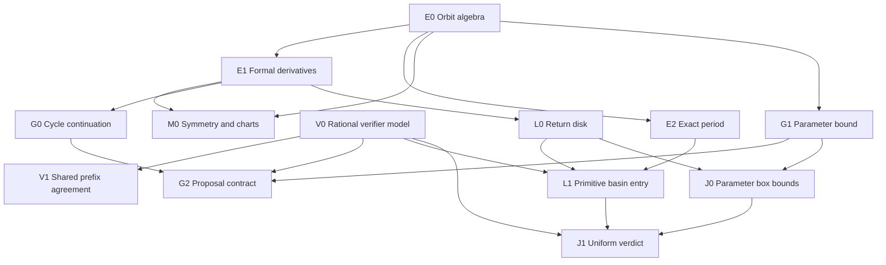

# Lightweight Lean proof DAG

**Status:** E0, E2, E1, M0, V0, and V1 have checked declarations in the isolated [Lean project](../../proof/README.md). G, L, J, and Phase 3 nodes remain scoped research obligations. The verifier result is conditional on a shared, exact, finite prefix; it does not establish a refinement theorem for TypeScript floating point.

An arrow denotes a mathematical prerequisite for a theorem or contract. Tests, implementation links, and benchmark gates are tracked separately. The graph is consumer driven; it is not a proof of Mandelbrot local connectivity.

## Checked roots and boundaries

| ID  | Lean declarations                                                                                                                                                                                   | Claim and direct consumer                                                                                                                                                                                                                                                                                                      | State                                                |
| --- | --------------------------------------------------------------------------------------------------------------------------------------------------------------------------------------------------- | ------------------------------------------------------------------------------------------------------------------------------------------------------------------------------------------------------------------------------------------------------------------------------------------------------------------------------ | ---------------------------------------------------- |
| E0  | `quadratic`, `orbit`, `orbit_zero`, `orbit_succ`, `orbit_add`                                                                                                                                       | Quadratic iteration over a commutative ring; common basis for all orbit arguments.                                                                                                                                                                                                                                             | Proved                                               |
| E2  | `exactPeriod_iff_closure_and_prime_quotients`, `exactPeriod_iff_proper_divisors`, `exactPeriod_iff_first_return`, critical-orbit specializations                                                    | Exact closure plus prime quotient exclusions, all proper divisor exclusions, or first positive return characterize the minimal period. The candidate is positive; numerical near-closure is not exact closure.                                                                                                                 | Proved                                               |
| E1  | `seedPolynomial_eval`, `seedPolynomial_derivative_zero`, `seedPolynomial_derivative_succ`, `parameterPolynomial_eval`, `parameterPolynomial_derivative_succ`, `fixedSeed_parameter_derivative_zero` | Formal polynomial derivatives prove seed recurrence D₀ = 1, Dₙ₊₁ = 2zₙDₙ and parameter recurrence Bₙ₊₁ = 2zₙBₙ + 1; for a variable seed B₀ is its derivative, while a constant seed gives B₀ = 0. Inputs to multiplier and continuation work.                                                                                  | Proved                                               |
| M0  | `orbit_map`, `minimalPeriod_map`, `transport_orbit`, `transport_minimalPeriod`, `negChart_minimalPeriod`, `conjugate_orbit`, `conjugate_minimalPeriod`, `conjugate_seedDerivative_normSq`           | Injective ring maps preserve exact period, bijective charts preserve period under conjugated dynamics, and complex conjugation transports the orbit, exact period, and squared seed-derivative magnitude (the squared multiplier on a periodic return). The sign chart gives a concrete negative-quadratic coordinate witness. | Proved                                               |
| V0  | `Thresholds`, `Frame`, `properDivisors`, `referenceReduction`, `reference`, `finish`                                                                                                                | Ordered, exact rational decisions for closure, divisors, and multiplier acceptance on caller-supplied evaluated frames. Payload fields are opaque; accepted fields and metadata are copied as a whole. Models the order of [`verifier.ts`](../../src/domain/verifier.ts).                                                      | Proved model; TypeScript refinement open             |
| V1  | `inlineReduction`, `inlineReduction_eq_reference`, `inline`, `inline_eq_reference`, `reference_refusal_preserves`, `inline_refusal_preserves`                                                       | Equal supplied frames, thresholds, candidate period, and old record imply equal verdict and output fields for the two ordered procedures; rejection preserves the prior record. Corresponds to the inlined lag scan in [`orbit.ts`](../../src/domain/orbit.ts).                                                                | Proved conditional model; TypeScript refinement open |

**Model precondition:** Frames contain exact rational residual squares and multiplier magnitudes with no NaN or infinities. A strict separation `acceptSquared < excludeSquared` is required. The theorem does not prove that binary64 `hypot`, rounding, signed zero, finite-value checks, transcendental angle/log fields, or period candidate selection refine these rational inputs. In particular, an accepted numerical residual does not imply exact periodicity. Existing differential and oracle tests are the current check against the actual code; a floating point error model would be required for a refinement proof. A chart theorem preserves period only for the transported map and corresponding point; it does not classify arbitrary parameter transformations of the canonical quadratic family.

## Unproved performance contracts

| ID  | Prerequisites | Precise target and consumer                                                                                                                                                                                                     | Status                                                                         |
| --- | ------------- | ------------------------------------------------------------------------------------------------------------------------------------------------------------------------------------------------------------------------------- | ------------------------------------------------------------------------------ |
| G0  | E1            | For Fₚ(z,c) = f_c^[p](z) − z and an exact periodic point with multiplier λ ≠ 1, establish a local, phase-consistent branch with parameter derivative ∂c f_c^[p](z)/(1−λ).                                                       | Conditional; adjacent-pixel transplantation                                    |
| G1  | E0, E1        | For the same initial seed and parameter difference δ, prove eₙ₊₁ = 2zₙeₙ + eₙ² + δ and an inductive absolute error bound from stated orbit and parameter bounds. A variable seed has its own e₀.                                | Conditional; transplant and Phase 3                                            |
| G2  | G0, G1, V0    | Bound the predictor remainder on a region where the absolute value of 1−λ has an explicit positive lower bound. The corrected seed remains a proposal until verified; the existing `guardDisplacement = 0.01` is not certified. | Conditional; [transplant PoC](../../poc/performance/src/kernels/transplant.ts) |
| L0  | E1            | Bound the return map g = f_c^[p] on a closed disk: the supremum of the derivative magnitude is at most q < 1, and the center displacement plus qr is at most r. Prove the unique fixed point and its multiplier bound.          | Research; trap-radius acceptance                                               |
| L1  | E2, L0, V0    | Establish critical-orbit entry and primitive period, or return unresolved. A fixed point of a return map alone does not select the basin reached by the critical orbit.                                                         | Research; [trap PoC](../../poc/performance/src/kernels/trap.ts)                |
| J0  | G1, L0        | Give outward interval or ball bounds uniformly over a parameter rectangle, including intermediate iterates and derivatives.                                                                                                     | Research; rigorous subdivision                                                 |
| J1  | J0, L1, V0    | Certify the same classification and period throughout a rectangle; otherwise subdivide or run the per-pixel verifier. Corner samples do not suffice.                                                                            | Research; block fill                                                           |

The optional catalog consumer H uses E2's all-proper-divisor criterion, but [generate_catalog.py](../../tools/generate_catalog.py) checks numerical residuals; certified center enumeration needs separate symbolic and root-enclosure obligations. Candidate ordering, SIMD, worker scheduling, and browser latency need engineering tests rather than new theorems in this graph.

## Phase 3 and symmetry exploration

[Phase 3](../PLAN.md#phase-3--measured-numerical-extension) is gated by a demonstrated product gap and [ADR 0002](../decisions/0002-phase-0-renderer-zoom-and-gpu-gate.md). The following overlays are conditional research topics, not current Phase 3 requirements.

| ID                       | Requires                | Target and mathematical boundary                                                                                                                                                                                                                                               |
| ------------------------ | ----------------------- | ------------------------------------------------------------------------------------------------------------------------------------------------------------------------------------------------------------------------------------------------------------------------------ |
| P1 Perturbation identity | E0, G1                  | At reference parameter c₀ with reference Zₙ and pixel zₙ at c₀+δc, prove dₙ₊₁ = 2Zₙdₙ + dₙ² + δc, including initial conditions. Exact algebra does not assert dₙ is small.                                                                                                     |
| P2 Rebase invariant      | P1                      | At the same iterate n, change reference to Z'ₙ at c₁ and prove δc' = c−c₁ and d'ₙ = dₙ−(Z'ₙ−Zₙ) preserve zₙ = Z'ₙ+d'ₙ. Specify index and reference validity.                                                                                                                   |
| P3 Error and glitch rule | P1, P2, G1, E1          | Bound reference, delta, and parameter-rounding errors, then require rebase, subdivision, CPU repair, or unresolved before acceptance. An exact identity does not certify a binary64 glitch threshold.                                                                          |
| D0 Interior field        | E1, G0                  | Define a potential or distance proxy on a specified hyperbolic chart; a first-order expression needs a domain and remainder estimate to bound Euclidean distance.                                                                                                              |
| X0 Exterior potential    | E0, escape-radius lemma | Define the escape-rate potential and finite-orbit approximation on an explicitly escaping region; external angles need a branch and validity domain.                                                                                                                           |
| S0 Significant Curves    | E2, low-period lemmas   | Prove a specific low-period locus and exact-period exclusions; resultants may include spurious branches and plots need approximation bounds.                                                                                                                                   |
| R0 Real-slice ordering   | E2                      | State a real interval map and orbit-forcing relation before studying a selected Sharkovsky ordering; avoid extrapolation to all complex components.                                                                                                                            |
| N0 Renormalization chart | E0, M0                  | Prove a concrete restricted return map and chart back to the canonical parameter. Polynomial-like properness and straightening remain separate, much larger obligations.                                                                                                       |
| F0 Parabolic coordinates | E0, M0                  | Fix the point, petal, and domain before proving Φ(f_c^[p](z)) = Φ(z)+1; address branch and normalization.                                                                                                                                                                      |
| M1 Further symmetries    | M0, E1                  | Test the logistic chart h(w) = a(1/2−w) for a ≠ 0, mapping a·w(1−w) to z²+c at c = a/2−a²/4, and search for other affine/antilinear charts. Prove orbit and period transport, then check multiplier transport and whether a chart gives a canonical-family parameter symmetry. |

The next short algebra branch is G1 → P1 → P2; P3 is the numerical gate for rendering. A high-precision or Wasm backend changes representation but still needs an arithmetic error model and verifier agreement. Raising the 6,000,000× product ceiling needs measured accuracy and latency.

Exploratory sources: [Significant Curves of the Mandelbrot Set](https://mendel-journal.org/index.php/mendel/article/view/157) and [Sharkovsky's Ordering in the Mandelbrot Set](https://arxiv.org/abs/2506.06163) motivate individual research targets, not certified classifiers. The [mlc dependency-graph script](https://github.com/kirill-kondrashov/mlc/blob/main/scripts/generate_dependency_graph_site.py) and [axiom check](https://github.com/kirill-kondrashov/mlc/blob/main/check_axioms.lean) motivate rooted declaration graphs with an explicit axiom frontier; our edges are reviewed mathematical prerequisites, not inferred declaration-use edges.

## Execution and evidence gates

1. Build the pinned Lean v4.33.1 project and run the [axiom guards](../../proof/IntMProof/Axioms.lean). The [manifest](../../proof/lake-manifest.json) pins Mathlib to `0df444a360eaa60ab8c11dca51a86af692955474`.
2. Run the package environment linter and Mathlib's text style checker as described in the [proof README](../../proof/README.md); CI audits all project declarations for unexpected axioms. Record Lean declaration, prerequisites, admitted axioms, and consuming code for each proved node.
3. For a performance feature, connect its exact contract to floating point behavior through refinement or error bounds, differential/oracle tests, and target-browser benchmarks. [Phase 2 status](../PERFORMANCE-PLAN.md) keeps the legacy scan as default pending Stage A evidence; proof work does not waive that gate.
