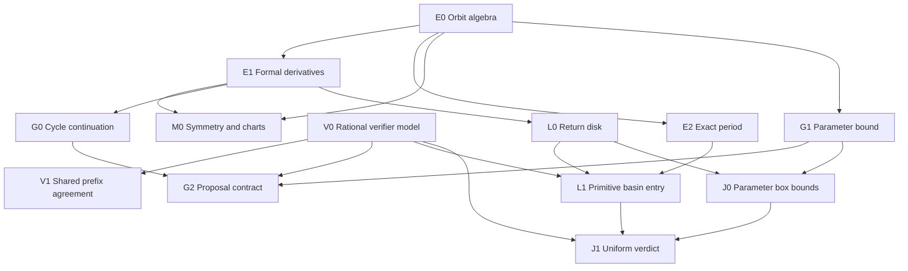

# Lightweight Lean proof DAG

**Status:** E0, E2, E1, M0, V0, and V1 have checked declarations in the isolated [Lean project](../../proof/README.md), including the constant-seed parameter sum, parameter-derivative conjugation, multiplier phase, perturbation identity and its complex-norm bound, the rebase identity, the local periodic graph and its slope, the first-order guard displacement and its little-o remainder, the return-disk contraction, contraction after a critical iterate has entered that disk, the least accepted divisor, and the period-1/period-2 fast paths. G2's frozen displacement constant, L1's proof that the critical orbit enters the disk, J, and the rest of Phase 3 remain scoped research obligations. The verifier result is conditional on a shared, exact, finite prefix; it does not establish a refinement theorem for TypeScript floating point.

An arrow denotes a mathematical prerequisite for a theorem or contract. Tests, implementation links, and benchmark gates are tracked separately. The graph is consumer driven; it is not a proof of Mandelbrot local connectivity.

## Checked roots and boundaries

| ID  | Lean declarations                                                                                                                                                                                                                                                                                                                                    | Claim and direct consumer                                                                                                                                                                                                                                                                                                                                                                                             | State                                                |
| --- | ---------------------------------------------------------------------------------------------------------------------------------------------------------------------------------------------------------------------------------------------------------------------------------------------------------------------------------------------------- | --------------------------------------------------------------------------------------------------------------------------------------------------------------------------------------------------------------------------------------------------------------------------------------------------------------------------------------------------------------------------------------------------------------------- | ---------------------------------------------------- |
| E0  | `quadratic`, `orbit`, `orbit_zero`, `orbit_succ`, `orbit_add`                                                                                                                                                                                                                                                                                        | Quadratic iteration over a commutative ring; common basis for all orbit arguments.                                                                                                                                                                                                                                                                                                                                    | Proved                                               |
| E2  | `exactPeriod_iff_prime_quotient`, `exactPeriod_iff_closure_and_prime_quotients`, `exactPeriod_iff_proper_divisors`, `exactPeriod_iff_closure_and_proper_divisors`, `prime_quotients_iff_proper_divisors`, `exactPeriod_iff_first_return`, `criticalPeriod_iff_prime_quotients`, `criticalPeriod_iff_proper_divisors`                                 | Exact closure plus prime-quotient exclusions, all proper-divisor exclusions, or first positive return characterize the minimal period. Closure may be bundled with either quotient test. The candidate is positive; numerical near-closure is not exact closure. The critical-orbit forms are the catalog's divisor condition.                                                                                        | Proved                                               |
| E1  | `seedPolynomial_eval`, `seedPolynomial_derivative_zero`, `seedPolynomial_derivative_succ`, `seedPolynomial_derivative_eval_prod`, `parameterPolynomial_eval`, `parameterPolynomial_derivative_zero`, `parameterPolynomial_derivative_succ`, `fixedSeed_parameter_derivative_zero`, `fixedSeed_parameter_derivative_eval_sum`                         | Formal polynomial derivatives prove seed recurrence D₀ = 1, Dₙ₊₁ = 2zₙDₙ, hence Dₙ = ∏*{k<n} 2zₖ, and parameter recurrence Bₙ₊₁ = 2zₙBₙ + 1. For a variable seed B₀ is its derivative; a constant seed gives B₀ = 0 and Bₙ = ∑*{k<n} ∏*{t<n−k−1} 2z*{k+1+t}. The product is the formal multiplier. It does not identify the TypeScript complex product loop.                                                          | Proved                                               |
| M0  | `orbit_map`, `minimalPeriod_map`, `transport_orbit`, `transport_minimalPeriod`, `negChart`, `negChart_quadratic`, `negChart_minimalPeriod`, `conjugate_orbit`, `conjugate_minimalPeriod`, `conjugate_seedDerivative`, `conjugate_seedDerivative_normSq`, `conjugate_fixedSeed_parameterDerivative`, `conjugate_fixedSeed_parameterDerivative_normSq` | Injective ring maps preserve exact period. Bijective charts preserve period under conjugated dynamics. Complex conjugation transports the orbit, exact period, seed derivative, constant-seed parameter derivative, and both squared magnitudes. `negChart` is Mathlib's `Equiv.neg` and sends the quadratic to `w ↦ −w² − c`.                                                                                        | Proved                                               |
| V0  | `Thresholds`, `Frame`, `properDivisors`, `mem_properDivisors`, `properDivisors_pairwise`, `referenceReduction`, `referenceReduction_eq_reduced_iff`, `referenceReduction_reduced_least`, `decide`, `reference`, `finish`                                                                                                                             | Ordered, exact rational decisions for closure, divisors, and multiplier acceptance on caller-supplied evaluated frames. `properDivisors` is strictly increasing. `.reduced d` means `d` is accepted and every earlier proper divisor is excluded, so it is the least such divisor. `decide` is the shared control flow. Payload fields are opaque. Models the order of [`verifier.ts`](../../src/domain/verifier.ts). | Proved model; TypeScript refinement open             |
| V1  | `inlineReduction`, `inlineReduction_eq_reference`, `inlineReduction_eq_reduced_iff`, `inline`, `inline_eq_reference`, `reference_refusal_preserves`, `inline_refusal_preserves`                                                                                                                                                                      | `inline` is `decide` applied to `inlineReduction`. Equal supplied frames, thresholds, candidate period, and old record imply equal verdict and output fields; rejection preserves the prior record. The inline and reference characterizations of `.reduced` agree. Corresponds to the inlined lag scan in [`orbit.ts`](../../src/domain/orbit.ts).                                                                   | Proved conditional model; TypeScript refinement open |

**Model precondition:** Frames contain exact rational residual squares and multiplier magnitudes with no NaN or infinities. A strict separation `acceptSquared < excludeSquared` is required. The theorem does not prove that binary64 `hypot`, rounding, signed zero, finite-value checks, transcendental angle/log fields, or period candidate selection refine these rational inputs. In particular, an accepted numerical residual does not imply exact periodicity. Existing differential and oracle tests are the current check against the actual code; a floating point error model would be required for a refinement proof. A chart theorem preserves period only for the transported map and corresponding point; it does not classify arbitrary parameter transformations of the canonical quadratic family.

## Unproved performance contracts

| ID  | Prerequisites | Precise target and consumer                                                                                                                                                                                                                                                                                                                                                                                                                                    | Status                                                                                                                                                                        |
| --- | ------------- | -------------------------------------------------------------------------------------------------------------------------------------------------------------------------------------------------------------------------------------------------------------------------------------------------------------------------------------------------------------------------------------------------------------------------------------------------------------- | ----------------------------------------------------------------------------------------------------------------------------------------------------------------------------- |
| G0  | E1            | `exists_branch_slope` gives a local graph `t ↦ φ t` of exact period-n points through `(c, z)` with `φ' = B / (1 - λ)` when `λ ≠ 1`. `branch_slope` is that derivative for any differentiable map that stays on the period-n set, and `branch_denominator_phase` shows `1 - λ` is the same at every cycle point; `B` still depends on the point. `exists_periodic_implicitSection` is the kernel section of `(λ - 1) dz + B dc` that the graph reparameterizes. | Local graph proved; a disk remainder stays open under G2                                                                                                                      |
| G1  | E0, E1        | The identity is `perturbation_zero` and `perturbation_succ`. The norm recurrence is `perturbation_norm_succ`. `seedShift` allows a different initial seed, with gap `‖z₁ - z₀‖`, and `seedShift_norm_le_perturbationBound` compares it with `perturbationBound`. The same-seed bound is `perturbation_norm_le_bound`. This is an exact complex-norm comparison.                                                                                                | Norm bound proved; binary64 remainder open                                                                                                                                    |
| G2  | G0, G1, V0    | `predictorDisplacement_eq` is `‖(B / (1 - λ)) δ‖ = ‖B‖ ‖δ‖ / ‖1 - λ‖`. `predictorDisplacement_le` replaces the denominator by a positive lower bound `α`. `branch_predictor_remainder` is the little-o remainder of that linear predictor along the local graph. The corrected seed remains a proposal until verified.                                                                                                                                         | Displacement and little-o remainder proved; `guardDisplacement = 0.01`, `1e-12`, and a disk remainder open. [transplant PoC](../../poc/performance/src/kernels/transplant.ts) |
| L0  | E1            | `existsUnique_fixedPoint_orbit_of_multiplier_le`: if the formal multiplier of `orbit c n` is at most `q < 1` on a closed disk and `‖orbit c n z₀ - z₀‖ + q r ≤ r`, the disk contains a unique fixed point whose multiplier is at most `q`.                                                                                                                                                                                                                     | Contraction criterion proved; trap constants and critical entry open                                                                                                          |
| L1  | E2, L0, V0    | `existsUnique_critical_return_of_entry`: if `orbit c k 0` lies in the return disk, later iterates `orbit c (k + m n) 0` stay there and approach the unique return fixed point at rate `q ^ m`. `minimalPeriod_return_fixedPoint_iff` is exact period of that fixed point. Entry of the critical orbit is still a hypothesis.                                                                                                                                   | Contraction after entry proved; critical entry and trap constants open. [trap PoC](../../poc/performance/src/kernels/trap.ts)                                                 |
| J0  | G1, L0        | Give outward interval or ball bounds uniformly over a parameter rectangle, including intermediate iterates and derivatives.                                                                                                                                                                                                                                                                                                                                    | Research; rigorous subdivision                                                                                                                                                |
| J1  | J0, L1, V0    | Certify the same classification and period throughout a rectangle; otherwise subdivide or run the per-pixel verifier. Corner samples do not suffice.                                                                                                                                                                                                                                                                                                           | Research; block fill                                                                                                                                                          |

The optional catalog consumer H uses E2's all-proper-divisor criterion, but [generate_catalog.py](../../tools/generate_catalog.py) checks numerical residuals; certified center enumeration needs separate symbolic and root-enclosure obligations. Candidate ordering, SIMD, worker scheduling, browser latency, the checkpoint spacing, and the proposal budget need engineering tests rather than new theorems in this graph.

## Checked extensions of the roots

These ring and list lemmas sit on E0, E1, E2, M0, and V0. Each one is exact algebra. None of them bounds a binary64 remainder or justifies a frozen numeric guard.

| Target                              | Declarations                                                                                                                                                                                                                                                                      | What it proves                                                                                                                                                                                                                                                                                                                                                                                                                                                                                                                                                                               | What it does not certify                                                                                                   |
| ----------------------------------- | --------------------------------------------------------------------------------------------------------------------------------------------------------------------------------------------------------------------------------------------------------------------------------- | -------------------------------------------------------------------------------------------------------------------------------------------------------------------------------------------------------------------------------------------------------------------------------------------------------------------------------------------------------------------------------------------------------------------------------------------------------------------------------------------------------------------------------------------------------------------------------------------- | -------------------------------------------------------------------------------------------------------------------------- |
| Constant-seed parameter sum         | `fixedSeed_parameter_derivative_eval_sum`                                                                                                                                                                                                                                         | For seed `C z`, Bₙ = ∑*{k<n} ∏*{t<n−k−1} 2 z_{k+1+t}. This is the closed form of the recurrence [`transplant.ts`](../../poc/performance/src/kernels/transplant.ts) evaluates as `B_cycle`.                                                                                                                                                                                                                                                                                                                                                                                                   | The Newton remainder, `guardDisplacement = 0.01`, or the denominator floor `1e-12`.                                        |
| Conjugate parameter derivative      | `conjugate_fixedSeed_parameterDerivative`, `conjugate_fixedSeed_parameterDerivative_normSq`                                                                                                                                                                                       | `starRingEnd ℂ` transports Bₙ and preserves its squared norm, in parallel with the seed derivative.                                                                                                                                                                                                                                                                                                                                                                                                                                                                                          | That a chart preserves the canonical family, or that conjugation commutes with rounding.                                   |
| Multiplier phase invariance         | `seedDerivative_periodic_phase`                                                                                                                                                                                                                                                   | If `orbit c n z = z`, the n-step seed derivative agrees at `z` and at `orbit c k z`. Closure is enough; the return need not be minimal.                                                                                                                                                                                                                                                                                                                                                                                                                                                      | Phase of a merely approximately periodic binary64 orbit.                                                                   |
| Perturbation recurrence             | `perturbation`, `perturbation_zero`, `perturbation_succ`                                                                                                                                                                                                                          | For one seed and parameter step δ, e₀ = 0 and eₙ₊₁ = 2 zₙ eₙ + eₙ² + δ. This is the identity half of G1 and of P1.                                                                                                                                                                                                                                                                                                                                                                                                                                                                           | That eₙ is small, or any glitch or rebase threshold.                                                                       |
| Least accepted divisor              | `properDivisors_pairwise`, `inlineReduction_eq_reduced_iff`, `referenceReduction_eq_reduced_iff`, `referenceReduction_reduced_least`                                                                                                                                              | `properDivisors` is strictly increasing. `.reduced d` means that residual is accepted and every earlier entry is excluded, hence `d` is the least such proper divisor.                                                                                                                                                                                                                                                                                                                                                                                                                       | That the TypeScript `%` scan, or a nonfinite residual, implements the list.                                                |
| Period-1 cardioid and period-2 bulb | `period1_fixedPoint`, `period1_seedDerivative`, `period2_return`, `period2_orbit`, `period2_product`, `period2_seedDerivative`, `period2_ne_of_discriminant`, `period2_not_fixedPoint`, `period2_minimalPeriod`, `period2_bulb_abs`, `period2_bulb_ne`, `mainCardioid_inequality` | If `s * s = 1 - 4 * c`, then `z = (1 - s) / 2` is fixed and its one-step derivative is `1 - s`. A root of `z² + z + (c + 1) = 0` returns in two steps with multiplier `4 * (c + 1)`; when `c ≠ -3 / 4` the minimal period is 2. `‖4 * (c + 1)‖ < 1` iff `‖c + 1‖ < 1 / 4`, and that open bulb excludes `c = -3 / 4`. If also `0 ≤ s.re`, then `‖1 - s‖ < 1` iff `q * (q + (x - 1/4)) < y² / 4` for `c = x + y I` and `q = (x - 1/4)² + y²`, the inequality in [`classifyInto`](../../src/domain/orbit.ts) and [`checkpoint.ts`](../../src/domain/checkpoint.ts). Mathlib's modulus is `‖·‖`. | `Math.hypot`, `Math.sqrt`, the componentwise principal-root sign, and the attraction margin `1 - attractMargin`.           |
| Rebase identity                     | `rebase_reconstruct`, `rebase_delta`                                                                                                                                                                                                                                              | At one seed and an arbitrary iterate, `zₙ = Z'ₙ + d'ₙ` for step `δc' = c − c₁`. Changing the reference from `c₀` to `c₁` gives `d'ₙ = dₙ − (Z'ₙ − Zₙ)`.                                                                                                                                                                                                                                                                                                                                                                                                                                      | A bound on `dₙ`, a glitch threshold, or a rounding error. P3 remains open.                                                 |
| First-order guard                   | `predictorDisplacement_eq`, `predictorDisplacement_le`, `branch_predictor_remainder`                                                                                                                                                                                              | `‖(B / (1 - λ)) δ‖ = ‖B‖ ‖δ‖ / ‖1 - λ‖`, and a positive lower bound `α ≤ ‖1 - λ‖` gives `‖B‖ ‖δ‖ / α`. Along the local periodic graph the linear predictor is the derivative, so the remainder over `‖δ‖` tends to 0.                                                                                                                                                                                                                                                                                                                                                                        | `guardDisplacement = 0.01`, the Newton floor `1e-12`, a remainder on a fixed disk, and periodicity of the corrected seed.  |
| Critical return after entry         | `mem_closedBall_critical_return`, `dist_critical_return_of_entry`, `existsUnique_critical_return_of_entry`, `minimalPeriod_return_fixedPoint_iff`                                                                                                                                 | If `orbit c k 0` is in the return disk, `orbit c (k + m n) 0` stays there and its distance to the unique fixed point is at most `q ^ m` times the entry distance. The fixed point has minimal period `n` exactly when no positive proper divisor returns.                                                                                                                                                                                                                                                                                                                                    | That the critical orbit enters the disk, `minLambda = 0.8`, `diskFactor = 4`, or period `n` for the critical point itself. |

The complex-norm perturbation bound, the rebase identity, the local periodic graph, the first-order guard displacement, and the return-disk contraction are checked. `exists_branch_slope` reparameterizes the kernel section as a graph `z(c)` whose derivative is `B / (1 - λ)`, and `branch_predictor_remainder` is the little-o remainder of that predictor. `existsUnique_critical_return_of_entry` contracts a critical iterate that has already entered the disk. `guardDisplacement = 0.01`, trap `minLambda = 0.8`, and disk factor 4 stay frozen PoC policy: the disk theorem supplies a sufficient `(q, r)` pair and does not compute those constants, and it does not prove that the critical orbit enters. Superattracting `arg λ = 0` and `κ = +∞` are verifier policy when the magnitude is zero, not a theorem about the quadratic.

## Phase 3 and symmetry exploration

[Phase 3](../PLAN.md#phase-3--measured-numerical-extension) is gated by a demonstrated product gap and [ADR 0002](../decisions/0002-phase-0-renderer-zoom-and-gpu-gate.md). The following overlays are conditional research topics, not current Phase 3 requirements.

| ID                       | Requires                | Target and mathematical boundary                                                                                                                                                                                                                                               |
| ------------------------ | ----------------------- | ------------------------------------------------------------------------------------------------------------------------------------------------------------------------------------------------------------------------------------------------------------------------------ |
| P1 Perturbation identity | E0, G1                  | The identity d₀ = 0 and dₙ₊₁ = 2Zₙdₙ + dₙ² + δc is checked as `perturbation_zero` and `perturbation_succ` for one shared seed. Exact algebra does not assert dₙ is small.                                                                                                      |
| P2 Rebase invariant      | P1                      | Checked as `rebase_reconstruct` and `rebase_delta` for an arbitrary index and one shared seed: δc' = c−c₁ and d'ₙ = dₙ−(Z'ₙ−Zₙ) preserve zₙ = Z'ₙ+d'ₙ. The identity does not bound dₙ.                                                                                         |
| P3 Error and glitch rule | P1, P2, G1, E1          | Bound reference, delta, and parameter-rounding errors, then require rebase, subdivision, CPU repair, or unresolved before acceptance. An exact identity does not certify a binary64 glitch threshold.                                                                          |
| D0 Interior field        | E1, G0                  | Define a potential or distance proxy on a specified hyperbolic chart; a first-order expression needs a domain and remainder estimate to bound Euclidean distance.                                                                                                              |
| X0 Exterior potential    | E0, escape-radius lemma | Define the escape-rate potential and finite-orbit approximation on an explicitly escaping region; external angles need a branch and validity domain.                                                                                                                           |
| S0 Significant Curves    | E2, low-period lemmas   | Prove a specific low-period locus and exact-period exclusions; resultants may include spurious branches and plots need approximation bounds.                                                                                                                                   |
| R0 Real-slice ordering   | E2                      | State a real interval map and orbit-forcing relation before studying a selected Sharkovsky ordering; avoid extrapolation to all complex components.                                                                                                                            |
| N0 Renormalization chart | E0, M0                  | Prove a concrete restricted return map and chart back to the canonical parameter. Polynomial-like properness and straightening remain separate, much larger obligations.                                                                                                       |
| F0 Parabolic coordinates | E0, M0                  | Fix the point, petal, and domain before proving Φ(f_c^[p](z)) = Φ(z)+1; address branch and normalization.                                                                                                                                                                      |
| M1 Further symmetries    | M0, E1                  | Test the logistic chart h(w) = a(1/2−w) for a ≠ 0, mapping a·w(1−w) to z²+c at c = a/2−a²/4, and search for other affine/antilinear charts. Prove orbit and period transport, then check multiplier transport and whether a chart gives a canonical-family parameter symmetry. |

The constant-seed parameter sum, the perturbation identity, its complex-norm comparison, and the rebase identity are checked. P3's rounding bound remains the numerical gate for a perturbation renderer. The local periodic graph, its slope, and the little-o guard remainder are checked. G2's frozen displacement constant is still open. L0's contraction criterion is checked, and so is contraction after a critical iterate has entered the disk. Proving that the critical orbit enters, and certifying the trap constants, remain open. A high-precision or Wasm backend changes representation but still needs an arithmetic error model and verifier agreement. Raising the 6,000,000× product ceiling needs measured accuracy and latency.

Exploratory sources: [Significant Curves of the Mandelbrot Set](https://mendel-journal.org/index.php/mendel/article/view/157) and [Sharkovsky's Ordering in the Mandelbrot Set](https://arxiv.org/abs/2506.06163) motivate individual research targets, not certified classifiers. The [mlc dependency-graph script](https://github.com/kirill-kondrashov/mlc/blob/main/scripts/generate_dependency_graph_site.py) and [axiom check](https://github.com/kirill-kondrashov/mlc/blob/main/check_axioms.lean) motivate rooted declaration graphs with an explicit axiom frontier; our edges are reviewed mathematical prerequisites, not inferred declaration-use edges.

## Execution and evidence gates

1. Build the pinned Lean v4.33.1 project and run the [axiom guards](../../proof/IntMProof/Axioms.lean). The [manifest](../../proof/lake-manifest.json) pins Mathlib to `0df444a360eaa60ab8c11dca51a86af692955474`.
2. Run the package environment linter and Mathlib's text style checker as described in the [proof README](../../proof/README.md); CI audits all project declarations for unexpected axioms. Record Lean declaration, prerequisites, admitted axioms, and consuming code for each proved node.
3. For a performance feature, connect its exact contract to floating point behavior through refinement or error bounds, differential/oracle tests, and target-browser benchmarks. [Phase 2 status](../PERFORMANCE-PLAN.md) keeps the legacy scan as default pending Stage A evidence; proof work does not waive that gate.
